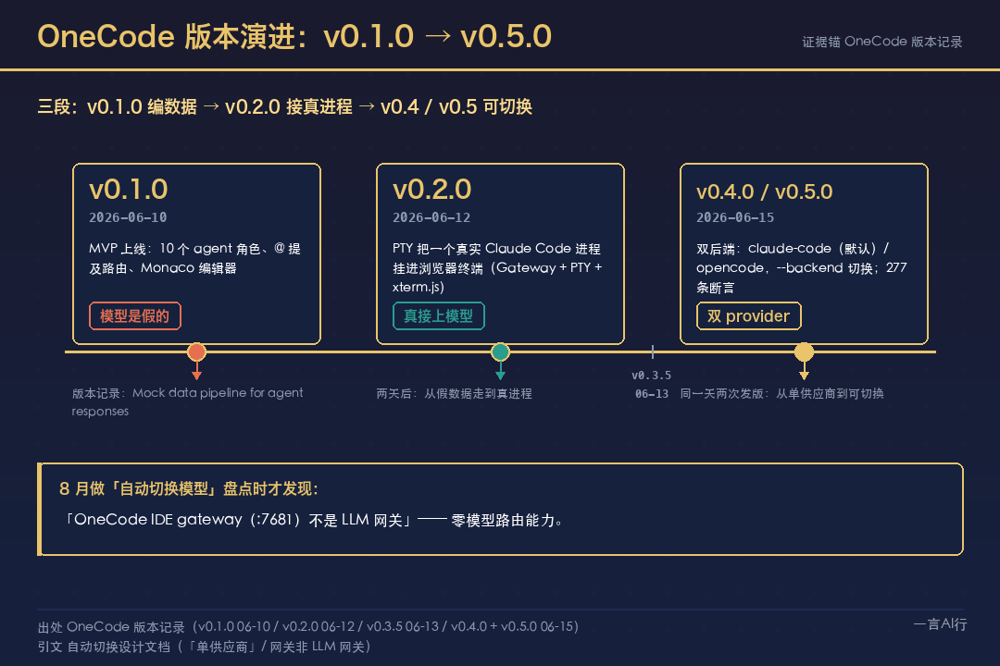
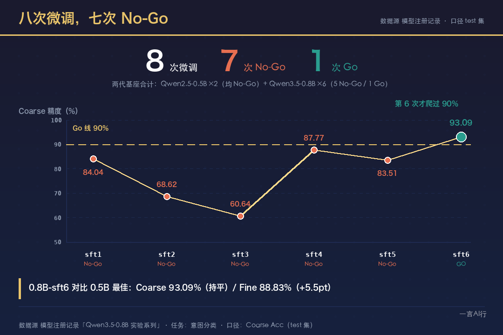

# 序章 · 从一个模型，到一个 AI System

2026 年 6 月 10 日，我提交了 OneCode 的第一个版本。版本记录里躺着一行字：

`Mock data pipeline for agent responses`

翻译成人话：那个版本里没有一个真模型。界面上那 10 个 AI 员工（CEO、架构师、开发、测试……）回你的话，是我编出来的假数据。

我当时的想法很朴素——先把壳搭好，回头接个模型就完事了。

后面两个月发生的事，一句话就能概括：

**我没有"接"上一个模型。我被逼着造了一个系统。**

---

## 先说清楚：这不是那篇分层文

免得你读到后面觉得"又在讲一遍分层"。今年 8 月我写过一篇《我把 AI 公司拆成 7 层》，AOSI 七层模型。那一篇画的是一张**组织地图**：从一块显卡到一家公司，L1 基座层到 L7 意图层，回答的是"**人怎么指挥机器**"——谁在哪一层干活、层与层之间怎么解耦。它属于另一本书（《一人公司：把一个人的边界，扩成一家公司》）。

序章画的是一张**原理地图**：从一个模型出发，一路翻车、被迫补零件，回答"**机器自己怎么运转、为什么非得长成这样**"。

这两张图不是同一张图：AOSI 问"谁来干"，这本书问"它为什么必须存在"。

---

## 第一幕：我以为接个模型就完事

OneCode 是什么？一句话：把 AI 编程命令行（Claude Code）包成一个"一人公司的员工调度台"。Web 版跑在 Docker 里，用浏览器访问；桌面版是 Tauri 原生窗口。你想让谁干活，在输入框里打一个 `@` 加角色名，就喊来了一个员工。

第一版（v0.1.0）里内置了 10 个 agent 角色，从 CEO、架构师到测试、财务，角色齐全、界面能看，`@角色名` 的路由也能跑起来。

只有一样是假的：**模型**。那一版的版本记录自己写着 `Mock data pipeline for agent responses`。

两天后 v0.2.0 才真正接上——用 PTY 把一个真实的 Claude Code 进程挂进浏览器终端。我当时的判断是：齐活了。

真正把这个判断打碎的，不是我自己想通的，是两个月后我为"自动切换模型"做现状盘点时写下的一份设计文档。里面白纸黑字两句话：

> **OneCode 的 Web 网关不是 LLM 网关**——它只是 Web IDE 的入口（页面 + 反向代理 + 终端通道），**零模型路由能力**。

> **现状是「单供应商」**：改模型 = 改配置 + 重启后端会话。

也就是说：那个我以为"已经完了"的系统只认识一个供应商，想换模型得改配置、重启整个后端会话；而那个"网关"，管的是网页和文件，跟模型无关。

**幻觉不是被我说破的，是被我写进自己的文档里的。**

---

## 第二幕：具体怎么翻的车

后面我翻了五次车，每一次都留了一份书面记录。

### 坑 1｜一个供应商，就能让全公司停摆

最早的问题意识记在 2026 年 7 月 14 日的一份基建笔记里：

> **单点依赖**：绑定单一模型供应商，限流 / 涨价 / 停服 = 全公司停摆
> **无法混调**：不同任务适合不同模型，没有统一调度层

这不是理论风险。同一份设计文档里，记录了已经发生的事：「本轮配额事件（网关 403 月额度用完导致全公司 agent 停摆）」——就这一天，我把"多供应商"从一个"想要的功能"，改写成了一次"风险对冲"。

只接一个模型供应商，**像把全公司的电闸装在同一栋楼里**——那栋楼一停电，所有人都只能等着。

### 坑 2｜小模型不是缩水的大模型

模型注册记录的「Qwen3.5-0.8B 实验系列」里有一段很不好看的记录：同一件事（意图分类），光把基座从 0.5B 换到 0.8B 我就调了 6 轮，Coarse 精度一路是：

84.04% → 68.62% → 60.64% → 87.77% → 83.51% → 93.09%，到第 6 次才爬过 90% 的 Go 线。

两代基座合起来，累计：**八次微调，七次 No-Go。**

我原来的想法是"小模型就是大模型砍一刀"。实际是，它不是能力打折，是**账要重新算**——后来我在本地把 Qwen3.5 的 2B 和 4B 放在同一套 8 项任务上对跑（**MLX 4-bit 量化**，同机同题、一次跑完），结论很反直觉：

| 指标 | 2B | 4B | 差距 |
|---|---|---|---|
| 客观质检通过 | 7/8 | 7/8 | **打平** |
| 峰值内存 | 1,989 MB | 3,255 MB | 4B 是 1.6 倍 |
| 直答吞吐 | 250.5 t/s | 131.4 t/s | 2B 快 1.9 倍 |

同一张卷子，做对了同样多的题；2B 只花约六成内存、一半的时间。

小模型的"小"，不是"弱"，是"**便宜**"。

### 坑 3｜测了，然后它崩了

本地模型的权威配置里，OCR 那一条的注释留着一句自白：

> Unlimited-OCR（int8/bf16）实测密集文档不稳，**已弃用**

现在跑的是 RapidOCR，0.5GB，0.2 秒一页。

这个坑教我的不是"要选好模型"，而是**评估必须跑到真实场景里去**：普通文档没问题，密集文档就散架。我们没有去调它、救它——直接换掉了它。

### 坑 4｜路由：指定了 A，活发给了 B

最开始，路由能力是零——那个"网关"根本不碰模型。我试过一条捷径，复用 IDE 网关来做模型路由，这份设计文档把它写成"方案 2"，当场证伪：那个网关"零模型路由能力"，唯一的路是桌面端自己造一层切换。

然后就有了最干净的一次"派错"。2026 年 8 月 22 日，我为自己记下的一条 bug，原话是：

> 那现在 onecode 有一个 bug，虽然是百炼，但是走的还是 deepseek

界面里我选的是百炼，流量却发去了 DeepSeek。根因只有一句话，但很反直觉：

> **配置文件里那一节 `env`，优先级高于进程环境变量。** 全局配置里那条指向 DeepSeek 的 `ANTHROPIC_BASE_URL`，会盖掉 OneCode 注入给子进程的供应商设置。

也就是说，**"我在界面上选了谁"和"活最后发给谁"，是两条互不相干的链路**——而且后者赢。修法是在拉起子进程时加一句 `CLAUDE_CODE_PROVIDER_MANAGED_BY_HOST=1`：声明"宿主托管 provider"，让它忽略配置文件、以进程环境为准。

修对之后还有第二层：路由通了，供应商却返回 `AccessDenied: Access to model denied`——那个 key 对我指定的模型没有访问权。**"派对了"和"能干活"，是两件事。**

而这个零件最贵的翻车不是派错，是它**整条停摆 9 天，没有任何人被告知**。2026 年 9 月 10 日，一次例行盘点里记着三行字：

> 三处基础设施静默故障（一个采集任务断了 5 天 / **本地 router 停摆** / 一条数据源故障拖到第 15 天）

本地三档 router 全部没在运行，两条主力业务线没有本地推理可用。整改项写的原因更难堪：

> 补最小告警规则（现在所有异常都靠人工读日志发现）

所以关于路由，我学到的是三件事：**选谁**、**认错时退到哪**，以及最重要的——**它不干活的时候，谁负责喊一声。** 一个会做错决定的组件不可怕；可怕的是它彻底躺平的时候，整个系统假装一切正常。

### 坑 5｜上下文是系统里最贵的那块地

先看三个数字。它们分散在三个地方，都是我亲手写下的：

- OneCode 的 agent 运行时：`CLAUDE_CODE_AUTO_COMPACT_WINDOW: 200000` + `CLAUDE_AUTOCOMPACT_PCT_OVERRIDE: 80`——20 万 token，用掉 80% 自动压缩
- 一次切换模型的启动脚本，把全局配置写成了 `autoCompactWindow: 1000000`
- 今天全局配置是 `48000`，而路由层还加了一道输入硬上限：`MAX_CHARS = 64000  # 输入安全网上限（约 30K token，prefill 不超过 45 秒），超限丢最旧历史`

三个"上下文预算"，最大和最小差了 20 倍。中间那个 1,000,000，是真翻过车的。

2026 年 8 月 23 日，我在排查"这台机器为什么一直发烫"。结论不是生成慢，是**每一次请求都要把整个上下文重新读一遍**：

- 实测：16K token 的输入，prefill 要 **6.6 秒**，且 `cached_tokens: 0`——一次缓存都没命中
- Claude Code 单次请求常带 5 万到 20 万 token，换算下来**每次请求 20–80 秒**；连续跑，GPU 就一直满载
- 根因只有一个数：窗口被写成 1M，auto-compact 几乎永不触发 → 上下文无限膨胀 → 每轮都在重读越来越长的历史

修法也很直白：`1000000` 改成 `48000`。一个数改小 20 倍，机器就不烫了。

上下文不是免费的。它是整套系统里唯一一块**你不主动设上限、它就自己涨到失控**的地——付出去的不是钱，是内存、延迟，和"开口之前先读多久"。

---

## 第三幕：被迫补上的那些零件

到这儿事情变成了一个很笨的循环：每翻一次车，补一个零件。补完回头一看，它们今天都有名字了。

> **图 A-0-3**（待出）：翻车 → 零件 → 名字 总图（一个坑 → 补一个零件 → 盖一个名字）

| 我被迫补的零件（按疼补的） | 今天行业给的名字 | 我这边的一手落地 |
|---|---|---|
| 一个模型不够用，得按档放好几个 | **Small Model / Model Pool** | 一份统一的本地模型配置清单：10 项——代码补全 / 语音识别 / 语音合成 / 视觉理解 / OCR / 图像生成 / 意图分类 / 情感分类 / 路由器 / HTML 渲染 |
| 得有人决定"这活派给谁" | **Router** | 一条三档路由脚本；一张 27 条 agent 路由表；两次翻车（派错供应商 / 停摆 9 天） |
| 上下文会满、而且很贵 | **Context Engineering** | 三个"上下文预算"（20 万 / 100 万 / 4.8 万）+ 路由层输入硬上限 |
| 东西不能散落在各个会话里 | **Knowledge / Memory** | 一个 Obsidian 知识库 + 一套分层的记忆目录 + agent 之间的交接单 |
| 一个 agent 干不完，一个人会累死 | **Agent** | 近 50 个 agent 定义（49 份）；OneCode 那个"员工调度台" |
| 跑一半崩了，得能接着跑 | **Harness / State** | 一个工作流引擎（5 个模块 + 5 个测试）；一条内容线的状态机；一个视频剪辑 agent |
| 没有闸门，等于没有系统 | **Evaluation / Gate** | 走查前的独立验证裁判 + 审稿的 P0-P3 分级（下面细说） |
| 同一个坑不能再摔第二次 | **闭环 / 反馈**（不是"自我进化"） | 9 月那次技能回灌 |

其中 Harness 那一行值得先补一句：它的价值不在"能跑"，在"断了能续"——**没有 Harness 的 agent 编排，像一条不能存档、不能续关的游戏**，退出一次，前面全白打。

这些零件我不是按名字补的，是按"疼"补的。其中两个最像"系统"，值得展开一句。

**闸门。** 前七个零件都是"让活干成"，第八个是"让错活干不成"。目前跑完整套审稿分级的稿子，算上序章也才两篇；其中一篇的过程正好说明闸门在干什么：初稿送审被打回——P0 一条、P1 两条、P2 四条。那条 P0 是，我把两家公司的一次架构动作写成了"同一个九月"，而官方技术报告里，一家在 8 月、一家在 9 月。审稿人拿着原始 PDF 逐页回核，把它抓了出来。改完重审，P0=0，通过。

闸门防的不是错字，是那种"看起来对、但没有来源"的话。**它不是让产出更好看，它是让这种东西发不出去。**

**闭环。** 我得把话说小一点。这里唯一能算"像闭环"的部分，**不是"AI 自我进化"**。它是：人写复盘 → 经验回灌成新版本技能。9 月 3 日，一篇内容复盘里的 8 条建议被逐条回灌，落成 10 条技能条目升版，其中多数直接写着"原因：那次发布里出的具体问题"。就这样，一次，人写的。

而且记忆策展那条线当时自己承认过一句很难听的话——"优化飞轮转不起来"。所以别把这儿写成飞轮，它更像一台手摇绞盘：转一圈，要人摇一次。

> **图 A-0-4**（待出）：零件地图 —— Model → Small Model → Model Pool → Router → Context → Knowledge/Memory → Agent → Harness/State → Evaluation/Gate → 闭环/反馈 → AI System

---

## 第四幕：今年，行业第一次把它们摆到同一张图上

我本来可以写一句很爽的话："2026 年，AI 圈冒出了一堆新概念"——但这是错的，懂行的人一眼就会拆。

Context Engineering，是 Anthropic 在 **2025 年**就在推的。Agent、Tool Use、Memory 更早。RAG 更早。Evaluation 更是个老得不能再老的概念。

**这些概念出现的时间并不相同。今年变的不是"冒出了新词"，而是它们第一次被摆到了同一张图上。**

以前这些词分属不同圈子：做检索的讲 RAG，做产品的讲 Agent，做基础设施的讲模型服务，做质量的讲评测。今年，它们开始出现在同一篇文章、同一张架构图、同一份招聘 JD 里。

所以"AI System"不是一个新词。它是**这些零件拼起来之后，那个东西的名字**。

序章要说的就是这句：

> **零件我早就在补了，只是今年它才第一次被整张图认领。**

### 但说实话，这套东西现在还很难看

我不想用一节序章把自己夸成一个"跑通了的系统"。几个真实缺口：

- **记忆分了三层，最上面那层是空的。** 那一层只有一个占位文件，一次都没用过。所以不能说"三级记忆都在运转"。
- **最底层没治理干净。** 那一层里混着跟技术栈无关的东西，有一份还是空模板。所以不能说"冷热分层已经治理好了"。
- **评估是分裂的。** 模型那条线有真实结果；内容和通用两条技能线只有框架，没有结果。
- **闸门只跑过两篇（算上序章）。** 完整的 P0-P3 审稿记录也才两份，不能推广成"全品类都这样"。

还有一件事必须说：**系统自己写的文档也会说谎。**

9 月 10 日的一次汇总里，有一句"小红书整线零产出"——事实是：当周的两篇试点确实没发，但整线并非零产出，9 月 3 日已经发过的那一篇，在汇总时被抹掉了。是被打回来才更正的。同一天定下一条规矩：任何"已完成 / 已发布 / 已上线"的断言，必须挂一手来源，否则不许往下传。

**这条规矩，就是序章每一段都在做的事。**

### 两张图叠起来，才是完整的

最后回一下开头那篇 AOSI。

这些零件在组织里的位置，那张图已经排过了：模型和数据在 L1，工具调用在 L2，技能工艺在 L3，单个 agent 在 L4，协作与交接在 L5。那一篇回答"**人怎么指挥机器**"，这一本回答"**每个零件为什么非得长成这样**"。

同一个系统，两张地图：一张画组织，一张画原理。叠在一起，才是一张完整的图。

---

## 这是一本书的序章

从这里开始，我会一个一个零件地拆，每个都挂真实的实验和真实的账；没有真实验的节，宁可等。

第一个要拆的，是整条链上最小的那个单位：**Token——你和模型之间唯一的通货。**

---

## 数据与出处

- OneCode 的版本记录与自动切换设计文档（单供应商自述、两种路由方案的证伪）
- 单点依赖的问题意识：2026-07-14 一份基建笔记《LLM 网关》
- 微调淘汰记录（8 次微调 / 7 次 No-Go）与 2B vs 4B 同题实测（MLX 4-bit，8 项任务）
- 本地模型配置清单（OCR 弃用自白、10 项注册）；三档路由脚本
- 供应商派错的现场记录（2026-08-22，含根因与修复）
- 上下文 1M 翻车的现场记录（2026-08-23，含阈值改动与输入硬上限）
- 审稿 P0-P3 分级记录（含一次 P0 打回：两家公司的架构动作被误写成同一个月）
- 技能回灌：2026-09-03 一次内容复盘的 8 条建议 → 10 条技能条目升版
- "优化飞轮转不起来"：一份技能质量盘点里的原话
- 路由停摆 9 天与一次汇总失真：2026-09-10 例行盘点
- 组织地图：《我把 AI 公司拆成 7 层》（AOSI 七层模型，属另一本书）
